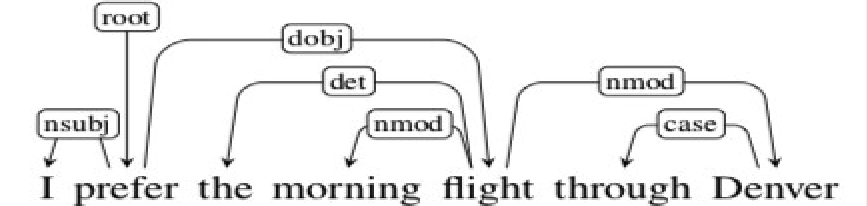
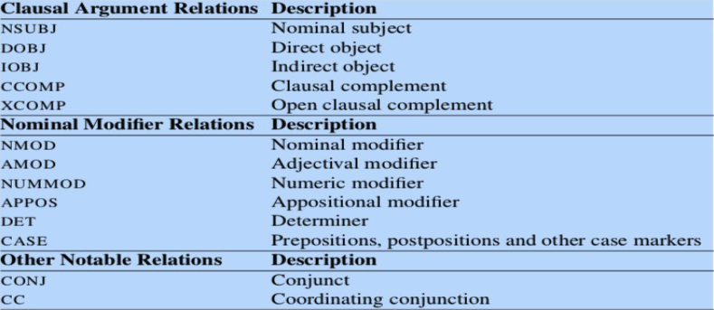
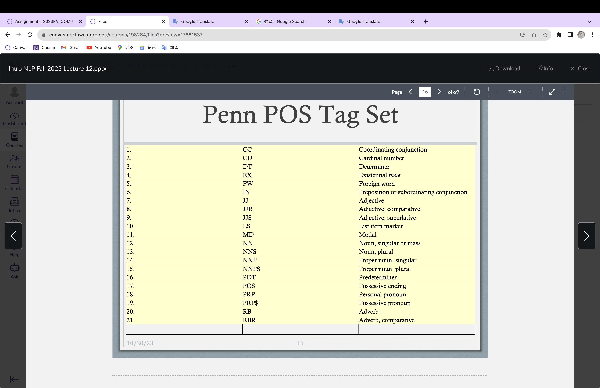
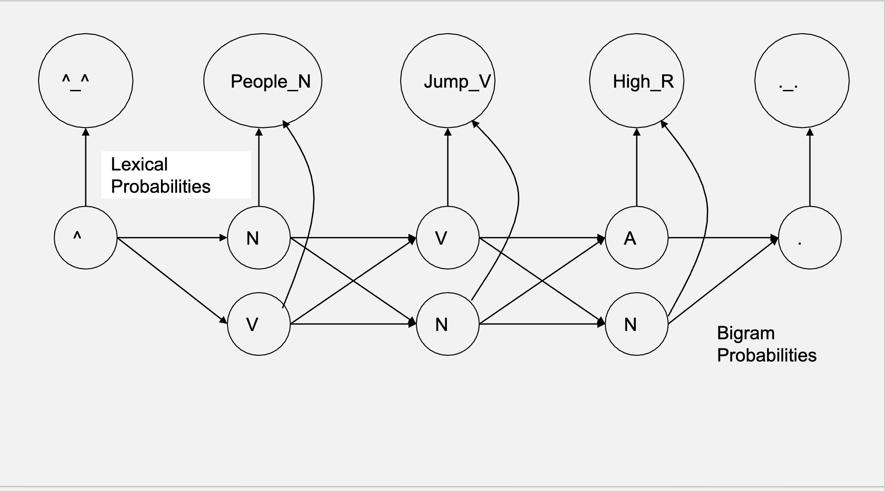

CS 337
===========
# Lec 1

## Read naively

1. Lexical Ambiguity

Garden path sentence. The first part of the sentence is misleading. 

2. Structure Ambiguity 

I ate dinner with a fork; I ate dinner with Marry.

3. Ellipsis
4. Vagueness

"get" -> "buy","borrow"......

5. Pronominal Reference

"that"

6. Metaphor(暗喻)
7. Implicit Content & Inference

Real world knowledge

# Lec 2

## Question answering 

Script / frame theory

• “Johnny beat up little Billy on the playground. The
next day, little Billy’s older brother beat up
Johnny.”

• Why did little Billy’s older brother beat up Johnny? -> **Revenge**

It matters who did what to whom. It matters that
the action taken in revenge attacks a goal of about
the same importance as that of the initiating
action.

knifing in response to beat up is excalation(升级)

## Causality matters
John lives in Wisconsin. Madison is the capitol of
Wisconsin. The University is in Madison. Sue
goes to the University.

**Every sentence shares entities with the previous sentence. So they are stuctural connected. But we can't see coherence between them.**

## Causal and representation
• "Marry killed John."

KILL (Actor: Mary; Object: John)

• "Marry almost killed John." -> structure ambiguity

1. Mary almost did something that would result
in John being dead.
2. Mary did something something that almost
resulted in John being dead.
3. Mary did something something that resulted
in John almost being dead.

# lec 3 
## Script/Frame theory

In self-driving car, is this behavior: 
1. learned 
2. built in 

`pre-built causal chains of actions and states representing steteotypical situations`

**retrieve** an entire, complete and connected representation and apply it to the situation.

### scripts / frames **define a context**

• **Enter**
• Patron enters Restaurant
• Patron waits
• Host brings Patron to Table
• Patron sits at Table

• **Order**
• Waiter brings Menu to
Patron
• Patron decides on Order
• Patron tells Order to Waiter

• **Wait (not too long)**
• Patron waits

• **Eat**
• Waiter brings Order to
Patron
• Patron eats Order

• **Pay**
• Waiter brings Check to
Patron
• Patron pays Check

• **Leave**
• Patron leaves Restaurant

### **vision** :

1. For a **room** frame : 
 what are you looking for when you come into the room?

walls, doors, paths, obsticle, 

### Example:

The Restaurant Script:

**See PPT**

## Frame-Based information extraction

regular expression

# Lec 4

## Project 1 
## Parsing
Simplest method — **keyword analysis.**

• E.g., look for “wins”, name of category, and name of
movie or person, in no particular order.

# lec 5
# Lec 6 

## Forward Chaining 
## Backward Chaining

• It’s really clunky — it produces a lot of irrelevant
inferences; and it can easily produce crazy
inferences.

• It doesn’t do a good job of answering “why”
questions around human intentionality; it lacks
abstraction and hierarchy; it misses the “big
picture.”

## So far
Forward-chaining + pattern-matching to infer
causal connections, mainly of the ENABLE and
RESULT type.
• Scripts/frames to recognize coherence of
stereotypical situations.

## Build a chain
• Start from goal.

• Ask: Are there any plans that will satisfy this
goal?

• Usually more than one.

• I.e., G  P1 v P2 v ... v Pn
• Pick one.

• Each plan is a sequence of sub-goals, i.e.,
smaller goals that need to be achieved to carry
out the plan.

• I.e., P  G1 & G2 & ... & Gn

• Thus when “unrolled” goals and plans can be
represented as AND-OR trees.

### Good example
• “Do you know when the next train to Grand
Central leaves?”
• “3:15, track 7.”
1. Why isn’t “yes” a good answer?
2. Where did “track 7” come from?

### Whats wrong
• John wanted to build bookshelves. He realized he
needed lumber.

• He went to Home Depot to buy lumber. He came
home.

• He realized he needed screws. He went to Home
Depot to buy screws. He came home.

• He realized he needed paint. He want to Home
Depot to buy paint. He came home.

• ...

In this frame, "he" is doing inefficiently.
So：**Combine loops that share extensive effort**

# Lec 7
## Frame/Scripts
越抽象，能涵盖的问题越多。

The trade-off between specificity / constraint of
information and abstraction / breadth of
applicability is nonlinear.

## Basic level Categories

ArmChair -> Chair -> Fruniture

**chair** is the basic categories, its really easy to recognize a chair from furniture, but its kind of defficult to recognize an armchair from charis.

### Example

Goal: get there quickly
Plan: drive and speed
Problem:

If you have a plan for a goal, but the plan has potatial **treat**, which is intermittant.

You think about a detector and try to detect the problem/threat and than find the right way to avoid the problem.

## Relevant vategories

**Rules can't be formulated simply in terms of presence or absence of obstacles.**

**Safety** is the main problem.

## Threat Detection 

For most case, you can't afford to stop every threat in advanced, so you need to detect them.

**fire brigade** strategy

Solution: Time-sharing -- the Night Watch makes their rounds.
## Turbocharger
Using otherwise wasted output energy to
pre-process the input in a useful way

# Lec 8

## Tasks and Dialog 

## Tasks Model

• Conversational interactions / dialogs in jointly
carrying out tasks requires a shared model of the
task.

• This task model delimits / specifies what you need
to do, and hence what you need to know.

• **This in turn delimits / specifies what you might talk about / ask about in each turn of the conversation.**

# Lec 9 
##  Structure
who did what to whom?

## Parsing
 1. X probs won Y;

 2. X won Y;

 3. X won Y in your dream.

There’s nothing a parser, on its own, can do
about that.

## Top down

start with output or frame 

## Functional constrain 
What tasks do we want the output of the
parser to support?

• E.g.: Answer questions. Translate. Summarize
or elaborate.

## Grammers
Rewrite rules

There are multiple grammatical models that we can use.

1. Phrase structure grammars: Focus on constituent structure.

2. Dependency grammars: Focus on relational structure.

### Pharse structure:

### Syntactic Parsing:

# Lec 11

## Dependency grammers

## Dependency Relation
](image-1.png)
### Why

• More generally, standard phrase structure
embeds semantically informative nodes inside
multiple layers of intermediate structure.

• E.g., the verb that often contributes the most
information to determining the right frame for the
sentence is subordinated under the “VP” node.

• Phrase structure doesn’t correspond very
directly to the semantic structure we need.

# Lec 12

## POS

### ambiguity

bank : could be verb or noun
 
### How to do it:

 1. Rule-based POS tagging.
2. Statistical ML-based POS tagging (e.g., Hidden
Markov Model).
3. Neural (Deep Learning)-based POS tagging

### algorithm

 Problem: large searching space.

 heuristic search: not finding the best, but finding the most likely path

 ## Hidden Markov Models (HMM) 
 
 Statistics are gathered and
conditional probabilities computed using only the
immediately prior tag (state)